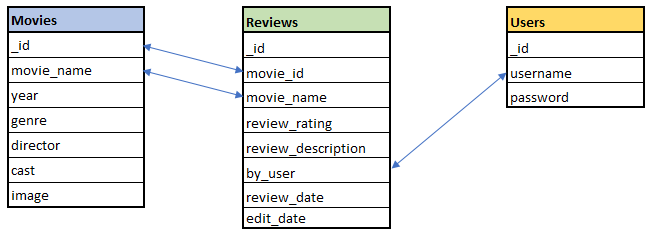

# [MyMovie](http://my-movie-project-jason.herokuapp.com/home)


This is a movie review website for all movie fans. Visitors of the site can search and view reviews and ratings for all kinds of movies, even without a registered account. If a user would like to write a review of their own, a registered account is required. Once registered, the user is able to write reviews and see their written reviews on their profile page. They will also have the ability to edit existing reviews, or remove them.

The Live website can be found [here](http://my-movie-project-jason.herokuapp.com/home).

# User Experience (UX)

## User Stories
- As a New Visiter:

    - I would like to browse the content of the website without registering or signing up.
    - I would like to see the director and the main cast of a movie.
    - I would like to view reviews for any particular movie which were written by other users.
    - I would like to register an account for the website.

- As a Registered User:

    - I would like to log in to the website.
    - I would like to add a rating and a review for a movie.
    - I would like to see when I wrote a review.
    - I would like to edit the review to add, remove or adjust parts of my description.
    - I would like to see when I edited a movie review.
    - I would like to change my rating score for a movie.
    - I would like to view all the reviews I have written.
    - I would like to remove my existing review.

- As an Administrative User:

    - I would like to add a movie to the database.
    - I would like to edit an existing movie such as the title, year of release, genre, director, cast and image.
    - I would like to delete or edit an existing review written by all users, in case the contents are inappropriate. 

## Design
### Colour Scheme
- The colours used for the project were taken from materialize.css. The site has a range of colours which I chose to mainly use the dark-grey pallete for the backgrounds. Having a dark background gave the site a feeling of a cinema experience. 
- For the headings, navigation and footer I used a deep orange which compliments the dark background. 
- For the text, I used the colour white for readability. 
- The buttons were also from materialize.css which were recoloured as appropriate. Red for Delete, and blue for Submit/Edit. 

### Typography
- The font-family used for headings, movie titles and navigation bar is "Squada One". This gave a unique look to the site and inline to the topic.
- The general body font used is "Encode". "Sans-Serif" is used as the fallback for situations where the initial fonts were failing to process.


### Wireframes and Mockups
- The design for the wireframes were created using Balsamiq. These can be viewed [here](./static/readme-images/wireframes.pdf).

# Features

### Navigation Bar and footer
- The navigation bar is fixed at the top of all pages for easy navigation. 

- On small devices, the nav bar will be compressed into a side menu which will open upon pressing the burger menu icon.

- The footer contains icons for social media links. The landing page for these will be the home page per social media site. No actual account was created for the website as this is for educational purposes.

### Home page
- There is a welcome message and a brief description of the website.

- There will be two panels showing at all times:
    - The first panel is dependant of the visitor being a registered user. If the visitor is not logged in, the panel will show links to the Log In page, or the Register page. If a user is logged in, the panel will show a Profile button, to redirect the user to the profile page.
    - The second panel is a link to redirect the all users to the Movies page.

### Movies page (List of Movies)

- The full list of movies can be found here. A search bar can be used to find particular movies. The search queries includes the movie title, movie genre, director and cast members.

- Each movie here will redirect to the individual movie page.

### Movie page (Individual Movie)
- Visitors can read reviews submitted by registered users.

- Registered users have the ability to rate and write a review. The rating is applied by using a slider and the review discription is a text input field.

- Registered users are able to delete or edit their existing review. Each registered user is limited to one review per movie.

- Where a registered user is logged in and has already placed a review, a message will show that they have already reviewed that particular movie.

- Each review will have a time stamp for when the review was created. A seperate time stamp will be present if a review has been edited.

- The Administrator is able to remove or edit all reviews.

- The Administrator is able to remove the Movie from the database or edit the Movie information.

- If the user wishes to delete a review, a warning modal will appear for confirmation.

- If the Administrator wishes to delete the Movie from the database, a warning modal will appear for confirmation.

### Log In page
- For registered users, they will need to input their username and password to log in to the website.

- If either the username or password is incorrect, a flash message will advise that they have entered an "Incorrect Username and/or Password".

### Register page
- There are two input fields here, "username" and "password". A visitor is able to register an account and proceed to write a review for a movie.

### Profile page
- The profile page will house all of the user's written reviews. There are three links for each review - "Go To Movie", "Edit Review" and "Delete Review".
    - "Go To Movie" - This button will redirect the user to the specific movie page for the written review.
    - "Edit Review" - This link will direct the user to the "Edit Review" page where they can make any changes to their movie rating and review description"
    - "Delete Review" - Once clicked, a modal will appear to advise if the user wishes to permantly remove the review from the database.

### Add Movie page
- Administrator access only. Here the admin has the ability to add a new movie to the database. The form contains fields which are all of the text input type. 

- If a user other than the admin attempts to view this page, a failsafe has been implemented that will advise that the user does not have permission to access the page.

### Edit Movie
- Administrator access only. The admin is able to change information related to the movie.

- A security feature is implemented so that all other users are not able to access this page. 

### Edit Review
- This can be accessed from a user's profile page and the individual movie page. The user will be able to edit their movie rating and description.

- The admin is able to edit all reviews created by all users. This is to ensure the content remains appropriate and no offensive language is used.

### Custom 404 page
- An errorhandler code was created for a custom 404 page. The page will advise the visitor/user that an error has occured.

- The page has a link to return to the Home page

### Administrator access
- The admin can edit or delete all movie reviews.

- The admin has the ability to edit or remove a Movie from the database.

### Future Features
- User password reset function where a user may have forgotten their password.

- A welcome email for when the user first registers.

- An advanced search option for movies such as selection boxes for genres and movie list sorting.

- Display an overall rating for a movie based on the total reviews.

- Embedded movie trailers from video sites such as youtube for each movie.

- A section on the home page to show popular and new movies. This could be housed in a carousel.

# Technologies Used

## Languages

- [HTML5](https://en.wikipedia.org/wiki/HTML5) - Used for the overall structure of the website.
- [CSS3](https://en.wikipedia.org/wiki/Cascading_Style_Sheets) - Used for styling, colouring and layout of the site.
- [Javascript](https://www.javascript.com/) - Used to make the website interactive. This was used for the modal and sliders.
- [Python](https://www.python.org/) - Used for creating functions that handle backend processes such as adding information to the database.

## Frameworks, Libraries & Programs

- [jQuery](https://jquery.com/) - A Javascript library that simplifies manipulation of of the HTML DOM.
- [Flask](https://flask.palletsprojects.com/en/1.1.x/) - A Python framework and used with [Jinja2](https://jinja.palletsprojects.com/en/2.11.x/) templating language. This is used for generating HTML templates and accessing/processing data sent from the frontend.
- [Materialize](https://materializecss.com/) - Used throughout the project. This assisted with the website layout, navigation bar and colour scheme.
- [Github](https://github.com/) - GitHub is used as a storage space for the project, where it can then be pushed onto Gitpod.
- [GitPod](https://www.gitpod.io/) - Git allowed version control and also to add, commit to Git and push to GitHub.
- [Balsamiq](https://balsamiq.com/wireframes/?gclid=CjwKCAjwkdL6BRAREiwA-kiczJUq8U_iMFrVp1xv8FmLNPGDxIxjk-d9dlu_X88qo79PfI1VkZbcaxoC5-QQAvD_BwE) - The wire frame software used for the initial design of the website.
- [Google Fonts](https://fonts.google.com/) - Used to apply the font families.
- [PicResize](https://picresize.com/) - This is used to resize large images down to smaller files.
- [Responsinator](http://www.responsinator.com/?url=) - Used to test the site responsiveness on various screen resolution sizes. This is to ensure the layout is intended as designed.


# Database

### MongoDB
MongoDB is the database used to store my collection of data. There are three collections of data - Movies, Reviews and Users. 
Each of the collections have a simple key-value format. 

- Movies 
    - This contains the movie's name, year of release, genre, director, cast and image url. All are text inputs.
    - Movies can only be added or edited by the admin.
    - The movie ID is the reference point for the Reviews collection.
    - The admin cannot add duplicate movies. This is based on the movie_name such that the application will advise the admin that the movie already exists in the database.
    - The image url is taken from IMDB poster images.

- Reviews
    - When a review is posted, the movie ID and movie name is set based on the movie being reviewed. 
    - The review description is a text input by the user.
    - The username refers to the creater or writer of the review.
    - Date created is time stamped automatically.
    - If a user edits a review, this is also automaticlly added.
    - Only one review can be written per movie for each user.

- Users
    - This contains the user's username and password.
    - Upon registration, the application will advise if a username is already taken to ensure no duplicate usernames are created.


### Database Relationship




# Testing

- Using [W3C Markup Validator](https://validator.w3.org/) to ensure there were no syntax errors in the HTML code. 
    - There were errors showing where the validator is unable to read the Jinja2 language. Flask creates HTML files using templates, by pulling variables from the backend. There were no actual errors found.
- For CSS, I used [W3C CSS Validator Services](https://jigsaw.w3.org/css-validator/#validate_by_input). No errors found here.
- For Javascript, I used [JSHint](https://jshint.com/) to ensure no errors in my code.
- For the Python code, the cornflaked-linter(flake8) extension is installed in the development environment. This gave a live validation check for the code.
- For the website responsiveness and overall look on various devices and screen size resolutions, [responsinator](http://www.responsinator.com/?url=) was used to ensure there were no overlapping images or incorrect alignments between elements. 
- The reponsiveness was also tested using the Chrome developer tools. The range of the resolutions were 350x650 to 2160x1440 whichi would cover a large variety real world screen devices. 
- 

## Testing User Stories

- As a New Visiter:

    - I would like to browse the content of the website without registering or signing up.
        - Any visitor of the site is able to browse movies and reviews without the need to sign up.
    - I would like to see the director and the main cast of a movie.
        - All information can be found on either the Movies list page or individual Movie page.
    - I would like to view reviews for any particular movie which were written by other users.
        - When a visitor clicks a Movie from the movie list, the individual Movie page will show all existing reviews that are written by registered users of the site. The username of the writer can be seen.
    - I would like to register an account for the website.
        - The Register link can be found on the Home page or on the Navigation Bar.

- As a Registered User:

    - I would like to log in to the website.
        - There is a Log In link on te Home page, and a link on the Navigation Bar.
    - I would like to add a rating and a review for a movie.
        - When the Registered User selects a movie from the movie list, they will be redirected to the Movie page where they can submit a rating and a review.
    - I would like to see when I wrote a review.
        - Once a review is posted, the time stamp can be seen at the bottom.
    - I would like to edit the review to add, remove or adjust parts of my description.
        - For their own written reviews, an "Edit Review" button is available where they can edit the rating or description.
    - I would like to see when I edited a movie review.
        - When a review is editted, a time stamp will be next to the created date/time to show when the review was editted.
    - I would like to change my rating score for a movie.
        - Similar to editting a review, the rating can be changed by clicking the "Edit Review" button
    - I would like to view all the reviews I have written.
        - On the Profile page, the registered user is able to see all their written reviews.
    - I would like to remove my existing review.
        - A "Delete Review" button is available for reviews written by the Registered User. A warning will appear for the user confirm the permanent removal of the review.

- As an Administrative User:

    - I would like to add a movie to the database.
        - For the admin user only, there is a "Add Movie" link in the Navigation Bar.
    - I would like to edit an existing movie such as the title, year of release, genre, director, cast and image.
        - Within each Movie Page, there is a "Edit Movie" button to change all or parts of the movie information.
    - I would like to delete or edit an existing review written by all users, in case the contents are inappropriate. 
        - Within each Movie Page, there is a "Delete Movie" button. A warning modal will appear for the admin to confirm the permanent removal of the movie.

### Manual Testing
Further extensive manual testing was performed. The documentation can be found [here]().

# Deployment

## MongoDB Setup for Cloning or Forking the Project.
The following steps were used to set up the database for the project.

1. Sign up to [MongoDB](https://www.mongodb.com/).
2. Select the "Shared Clusters" option.
3. Select the AWS Cloud Provider.
4. Select a region, in my case I chose Ireland as it is the closest to me.
5. Select the M0 Sandbox tier, which is the Free tier.
6. Name your Cluster in the Cluster Name field.
7. Select "Create Cluster". 
8. In the menu on the left, select "Database Access" under the "SECURITY" category.
9. Select "Add New Database User" and create a user for access to the datase.
10. Select "Clusters" tab.
11. Click the "Collections" button.
12. click "Add my own data" - this is where you create the database.
13. Add three collections called "movies", "reviews" and "users".
14. Go to Clusters and select "Connect"
15. Select "Connect your application"
16. Ensure that the Driver is "Python" and Version is "3.6 or later".
17. Copy and save the URL string that starts with "mongodb+srv://..."
18. Within your project, the following environment variables will need to be setup:

```
app.config["MONGO_DBNAME"] = "Your own database name"
app.config["MONGO_URI"] = "The URL string, ensure you replace the password holder with your own user password"
app.secret_key = "A random string" (Use a random key generator for security)
```

## Deploying to Heroku

To deploy our application on Heroku, it is essential to have a requirements.txt file and a Procfile. 
The two files will inform Heroku what dependencies are required to run the application, 
which file to run and ultimately, launch the application.

A GitHub repository, which will contain the project is also required.

The below steps were used to deploy to Heroku:

1. Create a requirements.txt file by typing in the terminal: "pip3 freeze --local > requirements.txt".
2. Create a Procfile by typing in the terminal "ech web: python app.py > Procfile"
3. Create an account on [Heroku](heroku.com) and then log in.
4. Select "New" and then "Create New App".
5. Choose a name for the app and a region.
6. Select "Create app"
7. In the Deployment method section, select the GitHub option. 
8. In the connect to GitHub section, make sure the GitHub profile is displayed.
9. Select the repository in the list of the project and then click "connect to this app".
10. Go to settings and in the Config Vars section, click "Reveal Config Vars".
11. Input all the config variables.
12. Return to the Deploy tab.
13. Check the "Enable Automatic Deploys"
14. Select the "master" branch to deploy.
15. Click the "Deploy Branch" button. 
16. Scroll to the top and click "Open app" to view the deployed website.


## Forking the Project
You can fork the project by visiting my repository. 

Below are the steps to do this:

1. Go to github.com and log in.
2. Go to my repository: https://github.com/JaeWong91/MyMovie
3. At the rop right of the page, click the "fork" button.
4. Make any changes to the project as you wish.
5. If you want to merge the changes to the project: 
6. Select the "pull request" button from your forked repository.
7. Select the button "new pull request".
8. Select the branches to merge with.
9. Select the "Create pull request" button.

## Cloning the Project
There are a few ways to clone a project. In this section, I will describe the method using the URL and Git Bash.

1. Go to my repository: https://github.com/JaeWong91/MyMovie
2. Click the "Code" button and under the HTTPS tab, copy the URL link by clicking the copy icon.
3. Open Git Bash and change the current working directory to the location where you want the cloned directory.
4. Type "git clone" followed by the URL you copied earlier, in this case "https://github.com/JaeWong91/MyMovie"
5. Press Enter to create your local clone.


# Credits

### Code
- Code institute Flask mini project video tutorials - This has assisted greatly for my project.

- Confirmation Modals - The code for creating warning modals for confirmation of deleting seperate movies or reviews - [Stack Overflow](https://stackoverflow.com/questions/28556370/confirmation-modal-for-flask-not-working-in-a-loop)

- Time stamps to show when a review was added and edited - [codegrepper.com](https://www.codegrepper.com/code-examples/python/datetime+today)

- Pagination on movie list page - Guidance and assistance from my mentor, Spencer Barriball

### Content
- All Movie information were obtained from [IMDB](https://www.imdb.com/?ref_=nv_home), arguably the most popular movie website.
- The Home page background image was taken from by a user named "Felix Mooneeram" on [unsplash.com](https://unsplash.com/s/photos/movie).


